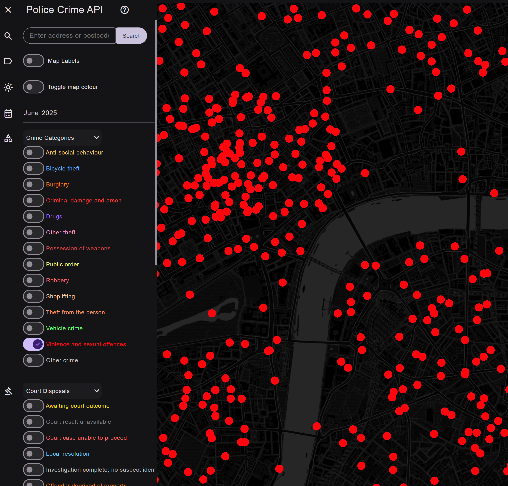

# A Map of UK Police Reported Crime 

[This app](https://leegee.github.io/crime-map-caching) accesses the [Police API](https://data.police.uk/docs/) in real time.

Out of the respect to the tax payer-funded API
[Rate limit](https://data.police.uk/docs/api-call-limits/),
makes no more than 10 requests per second, and out of respect of the user caches to Index DB, purging when reaching the maximum allowed by the storage manager.

Colours points by crime and optionally also by court disposal, the outcome - if any - of the police action.

## Usage

```bash
bun install
```



## Notes

[Police API Docs](https://data.police.uk/docs/)


https://data.police.uk/api/crimes-street/rape?poly=51.489827466868945,-0.14344636271601985:51.489827466868945,-0.10308092969165727:51.50810622724032,-0.10308092969165727:51.50810622724032,-0.14344636271601985:51.489827466868945,-0.14344636271601985&date=2025-06


Full list of valid categories per Police UK API:

https://data.police.uk/api/crime-categories

    [
        {
            "url": "all-crime",
            "name": "All crime"
        },
        {
            "url": "anti-social-behaviour",
            "name": "Anti-social behaviour"
        },
        {
            "url": "bicycle-theft",
            "name": "Bicycle theft"
        },
        {
            "url": "burglary",
            "name": "Burglary"
        },
        {
            "url": "criminal-damage-arson",
            "name": "Criminal damage and arson"
        },
        {
            "url": "drugs",
            "name": "Drugs"
        },
        {
            "url": "other-theft",
            "name": "Other theft"
        },
        {
            "url": "possession-of-weapons",
            "name": "Possession of weapons"
        },
        {
            "url": "public-order",
            "name": "Public order"
        },
        {
            "url": "robbery",
            "name": "Robbery"
        },
        {
            "url": "shoplifting",
            "name": "Shoplifting"
        },
        {
            "url": "theft-from-the-person",
            "name": "Theft from the person"
        },
        {
            "url": "vehicle-crime",
            "name": "Vehicle crime"
        },
        {
            "url": "violent-crime",
            "name": "Violence and sexual offences"
        },
        {
            "url": "other-crime",
            "name": "Other crime"
        }
    ]
